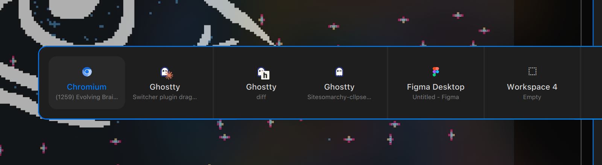

# Window Switcher

A macOS-style window switcher for the [Omarchy](https://omarchy.org) 4
(Quickshell) shell. Hold `SUPER`, tap `TAB` to cycle a horizontal strip of open
windows, release to focus the highlighted one. Click a tile to focus it, or drag
one onto another workspace to move it there.



- **Tiles are grouped by workspace** and sorted by on-screen position, with a
  rule between groups. Empty workspaces get a tile of their own, so a blank
  desktop is reachable without a separate keybind.
- **`SUPER+TAB` alternates**, the way every Alt-Tab does: the first tap lands on
  the window you came from, further taps in the same gesture walk the strip.
  The tiles are never reordered to do it.
- **Drag a tile onto a workspace group** to move that window there, landing at
  whichever boundary you drop on — before its first window, after its last, or
  between any two. Dropping on a tile's own group re-arranges it in place.
- **A terminal tile shows what is running in it** — a Claude session, a diff
  viewer, `btop` — as a small icon over the terminal's own.
- **A browser tile shows the favicon of the site it is on**, in that same
  corner, so four browser windows are told apart by where they are rather than
  by reading four truncated titles.

## Requirements

- Omarchy 4 (Quattro) and its Quickshell-based shell
- Hyprland, for `hyprctl` and the global-shortcuts protocol
- A Nerd Font as the shell's menu font, for the tile glyphs
- For site favicons only: `python3` with its `sqlite3` module (on Arch that is
  the `sqlite` package, an optional dependency of `python`). Without it every
  browser tile simply keeps its own icon and nothing else changes.

## Install

```bash
omarchy plugin add https://github.com/cllpse/omarchy-cllpse-plugin-switcher.git --enable
```

**Then install the keybinds — the plugin does nothing without them.** It has no
input of its own: it registers three global shortcuts and waits. Append
[`hypr/window-switcher-bindings.lua`](hypr/window-switcher-bindings.lua) to
`~/.config/hypr/bindings.lua`:

```bash
cat ~/.config/omarchy/plugins/cllpse.window-switcher/hypr/window-switcher-bindings.lua \
  >> ~/.config/hypr/bindings.lua
hyprctl reload
```

That file binds `SUPER+TAB` / `SUPER+SHIFT+TAB`, polls for the release of
`SUPER` to commit, and switches Omarchy's `SUPER + mouse:272` "Move window" bind
off while the strip is up so that clicks and drags reach the switcher instead.
It unbinds Omarchy's default `SUPER+TAB` (next workspace) first.

Optionally append
[`hypr/window-switcher-looknfeel.lua`](hypr/window-switcher-looknfeel.lua) to
`~/.config/hypr/looknfeel.lua` for blur and a map fade matching Omarchy's own
panels:

```bash
cat ~/.config/omarchy/plugins/cllpse.window-switcher/hypr/window-switcher-looknfeel.lua \
  >> ~/.config/hypr/looknfeel.lua
hyprctl reload
```

## Remove

```bash
omarchy plugin remove cllpse.window-switcher
```

Then delete the blocks you appended from `~/.config/hypr/bindings.lua` and
`~/.config/hypr/looknfeel.lua` and run `hyprctl reload`. Removing the bindings
block restores Omarchy's own `SUPER+TAB` and `SUPER + mouse:272` behaviour,
since this plugin only ever *rebinds* them at the end of your config. The plugin
writes nothing else: no state files, no edits to `shell.json` beyond the entry
`omarchy plugin add --enable` makes for you.

## Using it

| | |
|---|---|
| `SUPER+TAB` | open the strip / step forward |
| `SUPER+SHIFT+TAB` | step back |
| release `SUPER` | focus the highlighted window |
| move the pointer | highlight the tile under it |
| `SUPER` + click a tile | focus that window |
| `SUPER` + click beside the card | dismiss without switching |
| `SUPER` + drag a tile | move that window to the workspace you drop on |

Dragging shows a caret at the boundary the window would land on. Drop outside
the card and nothing happens. The strip auto-scrolls when you drag against
either edge.

Arranging works on a workspace laid out as one row or one column. A workspace
mixing horizontal and vertical splits has no ordering a single strip of tiles
could point at, and none is invented — the move simply stops when the layout
declines it.

## Terminal icons

A terminal tile carries a second icon for what is running inside it. The window
**title** is the only per-window signal available: a terminal running as a
single process reports the same pid for every one of its windows, so nothing
compositor-side can say which process belongs to which window. Shell integration
sets the title to the command as typed, which is the better signal anyway.

Icons are resolved by name against your installed icon themes, and the plugin
ships [99 of its own](icons) — app marks and CLI/agent logos, including
Ghostty's — so both the tiles and the process icons do something out of the box.
Those resolve **last**, after your own and after every installed theme, so they
only ever fill a gap. A program with no icon anywhere simply gets none. Claude
Code is recognised by the status marker it writes into the title.

**An icon is drawn exactly as it is.** No recolouring, no tinting, no theme
adaptation — the file is the source of truth for its own appearance, and the only
thing the plugin ever changes about one is its `viewBox`, so that every icon
fills its box the way Ghostty's does and they all render at the same size.

**Where icons are looked up**, in order — first hit wins:

1. `~/.config/omarchy/cllpse.window-switcher/icons/` — yours.
2. `~/.icons/cllpse-flat/apps/` — **optional, and almost certainly not on your
   machine.** It is where [omarchy-cllpse-macos](https://github.com/cllpse/omarchy-cllpse-macos),
   the configuration this plugin was extracted from, syncs app marks for the
   Omarchy menu; reading it means that setup shows one mark in both places. If
   the directory does not exist — the normal case — the plugin simply builds its
   index without it. Nothing else here reaches outside the plugin.
3. Your installed icon themes.
4. [`icons/`](icons) here, last.

**To add your own**, drop an SVG into
`~/.config/omarchy/cllpse.window-switcher/icons/` — outside the plugin, so an
update cannot conflict with it — and restart the shell. Name it after the window
class or the command; if the name and the icon differ, add a line to
[`icon-aliases.json`](icon-aliases.json). [`AGENTS.md`](AGENTS.md) has the
details, including how to scale a new one to match.

**The alias table is opinionated, and it is yours to edit.** It lives in
[`icon-aliases.json`](icon-aliases.json) at the root of this repository, not
in the QML. A command is looked up by its own name, so `btop`, `git`, `docker`,
`nvim`, `npm` and most others need nothing at all. The file exists for the two
cases where the name and the mark disagree.

**1. Your shell aliases it.** The title carries what you *typed*, not what ran:
if `diff` runs `hunk diff`, the title says `diff` while the icon is called
`hunk`. The shipped entries of this kind encode *one particular* shell's
aliases — edit them to match yours, or delete the ones you do not use. If you
do not alias `diff` to `hunk`, a real `diff` run gets hunk's icon until you
remove that line.

**2. The icon is named for something else.** Icons are named for a desktop
entry's `Icon=` value rather than for a command, so a Claude session's mark is
`claude-code.svg` and `claude` has to be pointed at it.

All 14 shipped entries, which is the whole file:

| title | resolves to | why |
|---|---|---|
| `diff`, `log` | `hunk` | shell aliases to the `hunk` diff viewer |
| `dash` | `gh` | alias to `gh dash` |
| `edit` | `msedit` | tool alias |
| `claude` | `claude-code` | named for the desktop entry, not the command |
| `convert`, `magick` | `imagemagick` | same |
| `ffprobe` | `ffmpeg` | same |
| `node`, `psql`, `python3`, `redis-cli`, `sqlite3`, `ytm` | `nodejs`, `postgresql`, `python`, `redis`, `sqlite`, `youtube-music` | same |

**The format is strict JSON** — one object of `"command": "icon-name"`, and
nothing else. It carries no comments, because JSON has none; this table is
where the entries are explained instead. Trailing commas are rejected too.

**Saved edits apply immediately**: the file is watched, so no restart is needed.
An edit that does not parse leaves the previous mappings in force and logs a
warning rather than silently dropping every icon — and the warning says the file
is strict JSON, since a stray comment is the likeliest way to land there.

One caveat, since the file is tracked: `omarchy plugin update` pulls this
repository, so local edits can conflict. `git checkout icon-aliases.json`
inside the plugin directory takes the shipped version back if that happens.

## Site favicons

A browser tile carries the favicon of the site it is showing, in the corner slot
a terminal's process icon uses.

> **This gives the switcher read access to your browsing history database.**
> There is no way to do this without it. A browser window exposes no URL — not
> in its class, not in its title, not on the Wayland handle — so the only way
> to know which site it is on is the page title, joined against the browser's
> own history. The favicon then comes from the browser's favicon cache. Both
> are SQLite files in your profile, which is why the plugin ships
> [`favicons.py`](favicons.py); QML cannot read them.
>
> What it does with that access: opens both databases read-only, looks up
> **only the page titles currently on screen**, and returns an image over a
> pipe. It never enumerates history, and with no browser window open it does
> not run at all — not even the sweep that looks for profiles.
>
> **It writes nothing into your profile**: no database, no journal, no WAL, and
> not even the read-mark an ordinary read-only SQLite connection leaves behind
> in a `-shm`. Which URI achieves that depends on whether a browser currently
> has the file open — `mode=ro&immutable=1` where none does, since it takes no
> lock at all and that is the only way to read a running Chromium;
> `mode=ro&readonly_shm=1` where one does and a WAL may hold rows the main file
> does not. [`favicons.py`](favicons.py)'s `ro()` carries the measurements
> behind that choice.
>
> **How often it reads:** once for each page title that appears on screen, and
> up to three times for one it cannot resolve. A browser does not write a visit
> to its history when it happens — Chromium commits about 10s later — so the
> first look at a page you have just opened finds nothing, and a retry 12s
> after that is what makes the badge appear at all. A title that resolves is
> never asked about again, and one that has failed three times is dropped.
>
> But the access is broader than the use, and only the code keeps it narrow: if
> you would rather not grant it, delete `favicons.py` and browser tiles fall
> back to their own icon.

**Which browsers.** Both families, found by the two database files in a
profile rather than by name — `History`+`Favicons` for Chromium, Chrome, Brave,
Vivaldi, Edge, Helium; `places.sqlite`+`favicons.sqlite` for Firefox, LibreWolf,
Zen, Waterfox, Floorp. That is the only browser-specific knowledge in the file:
a table of two rows, four strings each. A third family is a row, not a code
path. The sweep descends three levels below a hidden top-level directory of
`$HOME`, which reaches `.config/chromium/Default` and
`.mozilla/firefox/x.default` as well as Brave's deeper
`.config/BraveSoftware/Brave-Browser/Default`. A flatpak profile sits one level
deeper still and is deliberately not found.

**What it cannot do**, each ending as no badge rather than a wrong one: an
incognito window, a local file or a `chrome://` page, a profile the sweep does
not reach, and a fork whose title suffix is unknown. A page you have only just
opened is a fifth case but a passing one — it has no badge until the browser
commits the visit, and the retry above is what picks it up. Installed web apps
are excluded on purpose — their class already carries the host, so the tile is
already the site's icon.

**Accuracy is a property of your history.** Over the 200 most recent pages in
the profile this was built against, every one resolved and 145 resolved the
byte-identical icon the true URL would have; the 55 that differed were one
session of CDN-hosted images sharing titles with their origin site, where the
origin's mark is the better answer. Unread-count prefixes (`(12) Inbox`) are
stripped on both sides. Firefox is verified against a reconstructed profile
rather than a real one, its WAL included: with a live writer holding 398 of 399
rows uncheckpointed, all 399 are read and not one byte of the profile changes.

## Theming

The card binds the active theme's menu colours and Hyprland's `decoration:rounding`,
so it tracks your theme with nothing to configure. Three sizes can be pinned
from a theme's `[spacing]` section if you want them different:

| token | default | what it sets |
|---|---|---|
| `switcher-cell-width` | 150 | tile width |
| `switcher-group-gap` | 36 | extra space between workspace groups |
| `switcher-row-height` | 104 | tile height floor |

## Notes

- The plugin runs inside the existing Omarchy shell process and starts no
  Quickshell of its own. It shells out to `hyprctl` to focus and move windows,
  once at startup to index your icon themes, once on first sight of a browser
  window to find profiles, and to `favicons.py` when a browser page title it has
  no answer for appears. **Opening the strip spawns nothing** — a lookup is
  triggered by a page title changing, not by activation, and is skipped when
  every title on screen already has an answer. Profiles are found once per
  session (28ms) and cached for it; a lookup is ~17ms, of which under half a
  millisecond is the query and the rest is Python starting.
- Windows on special workspaces (the scratchpad) are deliberately not listed.
- Live edits inside a plugin directory may not auto-reload; run
  `omarchy-restart-shell` after changing files here.

## License

MIT — see [LICENSE](LICENSE).
